## Android Components Architecture in a Modular Word
[](https://circleci.com/gh/VMadalin/android-modular-architecture/tree/master)
[](https://codecov.io/gh/VMadalin/android-modular-architecture)
[](https://www.codacy.com/manual/VMadalin/kotlin-sample-app?utm_source=github.com&amp;utm_medium=referral&amp;utm_content=VMadalin/kotlin-sample-app&amp;utm_campaign=Badge_Grade)
[](https://ktlint.github.io/)
[](http://kotlinlang.org/)
[](https://lv.binarybabel.org/catalog/gradle/latest)
[](https://android-arsenal.com/api?level=21)
[](http://www.apache.org/licenses/LICENSE-2.0)


Android Components Architecture in a Modular Word is a sample project that presents modern, 2020 approach to [Android](https://www.android.com/) application development using [Kotlin](https://kotlinlang.org/) and latest tech-stack.

The goal of the project is to demonstrate best practices, provide a set of guidelines, and present modern Android
application architecture that is modular, scalable, maintainable and testable. This application may look simple, but it
has all of these small details that will set the rock-solid foundation of the larger app suitable for bigger teams and
long application lifecycle management.

## Table of Contents

-   [Mentions](https://github.com/VMadalin/kotlin-sample-app#mentions)
-   [Development](https://github.com/VMadalin/kotlin-sample-app#development)
-   [Design](https://github.com/VMadalin/kotlin-sample-app#design)
-   [Architecture](https://github.com/VMadalin/kotlin-sample-app#architecture)
-   [Documentation](https://github.com/VMadalin/kotlin-sample-app#documentation)
-   [Tech-stack](https://github.com/VMadalin/kotlin-sample-app#tech-stack)
-   [Resources](https://github.com/VMadalin/kotlin-sample-app#resources)
-   [Contributions](https://github.com/VMadalin/kotlin-sample-app#contributions)
-   [Authors](https://github.com/VMadalin/kotlin-sample-app#authors)
-   [License](https://github.com/VMadalin/kotlin-sample-app#license)

## Mentions

The project received different mentions/reference from Android Developer Community:

-   [Android Weekly](https://androidweekly.net/issues/issue-407) Newsletter that helps you to stay cutting-edge with your Android Development.
-   [AndroidSweets](https://androidsweets.ongoodbits.com/2019/12/13/browsing-through-the-android-open-source-project-was-never-easier) Fresh news from Droid zone.
-   [Android Awesome](https://github.com/JStumpp/awesome-android#code-examples) A curated list of awesome Android libraries and resources.
-   [Droidcon](https://www.droidcon.com/news-detail?content-id=/repository/collaboration/Groups/spaces/droidcon_hq/Documents/public/news/android-news/Android%20Components%20Architecture%20in%20a%20Modular%20Word) Blog posts from leading authorities and video archive from droidcons around the world.
-   [DroidconKE](https://github.com/droidconKE/droidconKE2020App#referencesresources-1) The official DroidconKE 2020 conference App.
-   [Github trending](https://github.motakasoft.com/trending/?d=2019-12-11&l=all) See what the GitHub community is most excited about today.
-   [KotlinBy](https://github.com/KotlinBy/awesome-kotlin#projects-back--1) A curated list of awesome Kotlin related stuff.
-   [Reddit](https://www.reddit.com/r/Kotlin/comments/ew30x4/github_vmadalinkotlinsampleapp_android_sample_app/?utm_source=share&utm_medium=web2x): Discussion about Kotlin, a statically typed programming language for the JVM, Android, JavaScript, and native.

## Development

### Environment setup

First off, you require the latest Android Studio 4.1.0 (or newer) to be able to build the app.

You need to supply keys for Marvel API. You can find information about how to gain access by using the [link](https://developer.marvel.com).

When you obtain the keys, you can provide them to the app by putting the following in the `local.properties` project root file:

```properties
#Marvel API KEYS
marvel.key.public = <insert>
marvel.key.private = <insert>
```

### Code style

To maintain the style and quality of the code, are used the bellow static analysis tools. All of them use properly configuration and you find them in the project root directory `.{toolName}`.

| Tools                                                   | Config file                                                                       | Check command             | Fix command               |
|---------------------------------------------------------|----------------------------------------------------------------------------------:|---------------------------|---------------------------|
| [detekt](https://github.com/arturbosch/detekt)          | [/.detekt](https://github.com/VMadalin/kotlin-sample-app/tree/master/.detekt)     | `./gradlew detekt`        | -                         |
| [ktlint](https://github.com/pinterest/ktlint)           | -                                                                                 | `./gradlew ktlint`        | `./gradlew ktlintFormat`  |
| [spotless](https://github.com/diffplug/spotless)        | [/.spotless](https://github.com/VMadalin/kotlin-sample-app/tree/master/.spotless) | `./gradlew spotlessCheck` | `./gradlew spotlessApply` |
| [lint](https://developer.android.com/studio/write/lint) | [/.lint](https://github.com/VMadalin/kotlin-sample-app/tree/master/.lint)         | `./gradlew lint`          | -                         |

All these tools are integrated in [pre-commit git hook](https://git-scm.com/book/en/v2/Customizing-Git-Git-Hooks), in order
ensure that all static analysis and tests passes before you can commit your changes. To skip them for specific commit add this option at your git command:

```properties
git commit --no-verify
```

The pre-commit git hooks have exactly the same checks as [CircleCI](https://circleci.com/) and are defined in this [script](https://github.com/VMadalin/kotlin-sample-app/blob/master/scripts/git-hooks/pre-commit.sh). This step ensures that all commits comply with the established rules. However the continuous integration will ultimately be validated that the changes are correct.

## Design

App [support different screen sizes](https://developer.android.com/training/multiscreen/screensizes) and the content has been adapted to fit for mobile devices and tablets. To do that, it has been created a flexible layout using one or more of the following concepts:

-   [Use constraintLayout](https://developer.android.com/training/multiscreen/screensizes#ConstraintLayout)
-   [Avoid hard-coded layout sizes](https://developer.android.com/training/multiscreen/screensizes#TaskUseWrapMatchPar)
-   [Create alternative layouts](https://developer.android.com/training/multiscreen/screensizes#alternative-layouts)
-   [Use the smallest width qualifier](https://developer.android.com/training/multiscreen/screensizes#TaskUseSWQuali)
-   [Use the available width qualifier](https://developer.android.com/training/multiscreen/screensizes#available-width)
-   [Add orientation qualifiers](https://developer.android.com/training/multiscreen/screensizes#TaskUseOriQuali)

In terms of design has been followed recommendations [android material design](https://developer.android.com/guide/topics/ui/look-and-feel) comprehensive guide for visual, motion, and interaction design across platforms and devices. Granting the project in this way a great user experience (UX) and user interface (UI). For more info about UX best practices visit [link](https://developer.android.com/topic/google-play-instant/best-practices/apps).

Moreover, has been implemented support for [dark theme](https://developer.android.com/guide/topics/ui/look-and-feel/darktheme) with the following benefits:
-   Can reduce power usage by a significant amount (depending on the device’s screen technology).
-   Improves visibility for users with low vision and those who are sensitive to bright light.
-   Makes it easier for anyone to use a device in a low-light environment.

| Mode  | Characters list                                                          | Characters favorite                                                          | Character detail                                                          |
|-------|--------------------------------------------------------------------------|------------------------------------------------------------------------------|---------------------------------------------------------------------------|
| Light | 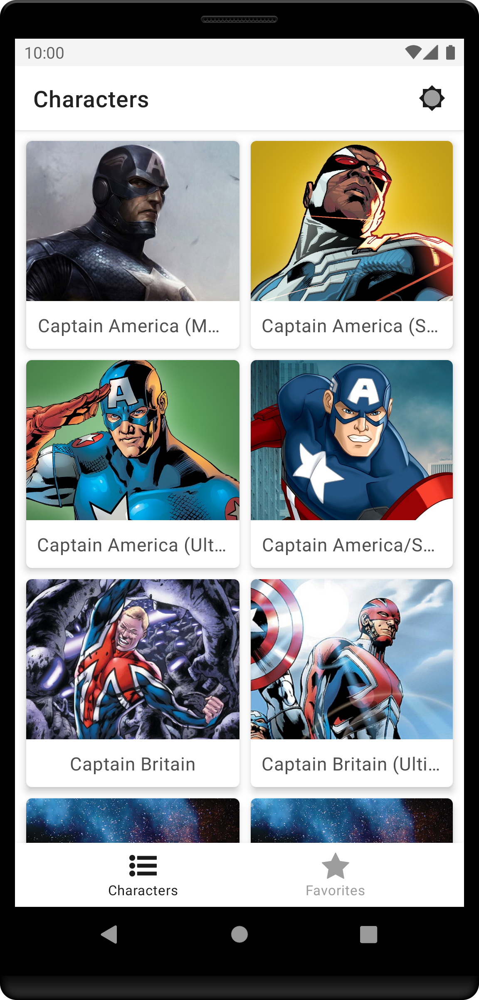 | 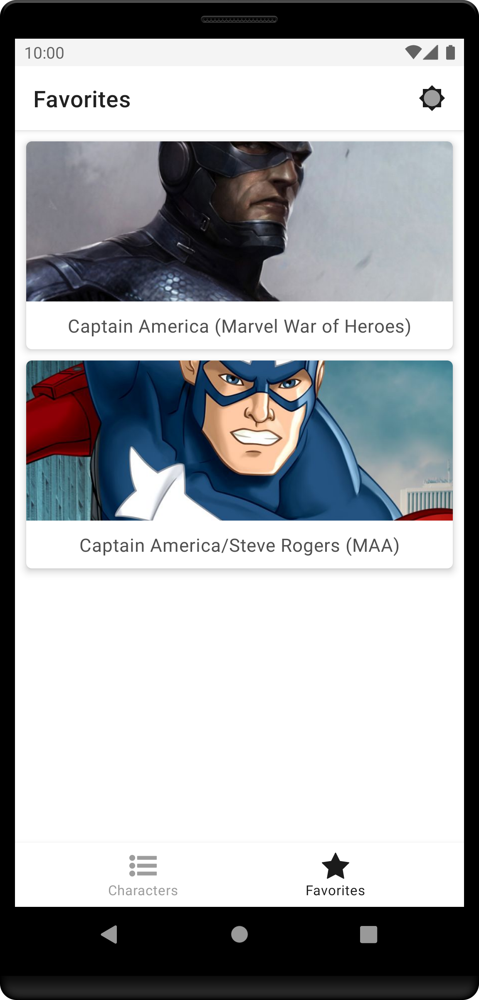 |  |
| Dark  | 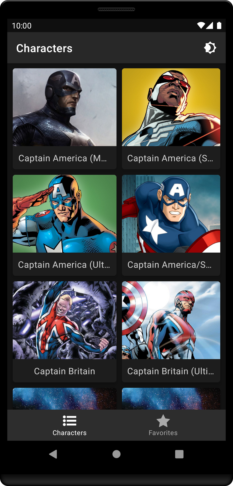  | 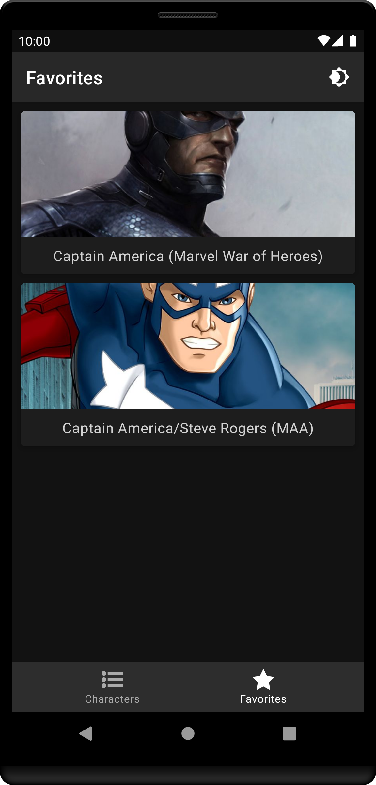  |   |

## Architecture

The architecture of the application is based, apply and strictly complies with each of the following 5 points:

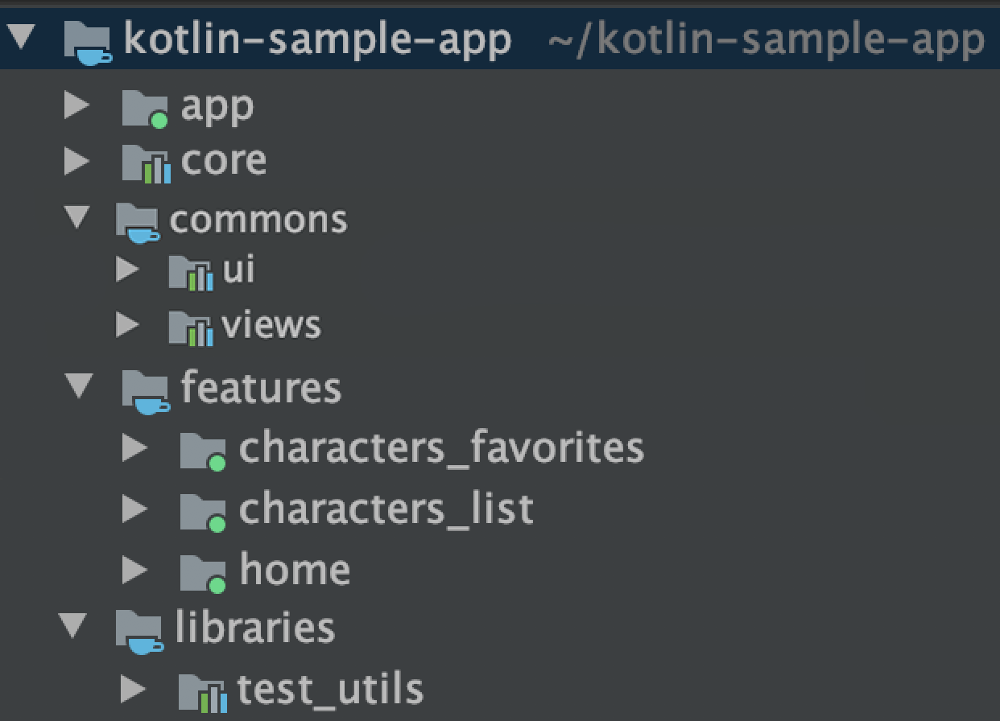

-   A single-activity architecture, using the [Navigation component](https://developer.android.com/guide/navigation/navigation-getting-started) to manage fragment operations.
-   [Android architecture components](https://developer.android.com/topic/libraries/architecture/), part of Android Jetpack for give to project a robust design, testable and maintainable.
-   Pattern [Model-View-ViewModel](https://en.wikipedia.org/wiki/Model%E2%80%93view%E2%80%93viewmodel) (MVVM) facilitating a [separation](https://en.wikipedia.org/wiki/Separation_of_concerns) of development of the graphical user interface.
-   [S.O.L.I.D](https://en.wikipedia.org/wiki/SOLID) design principles intended to make software designs more understandable, flexible and maintainable.
-   [Modular app architecture](https://proandroiddev.com/build-a-modular-android-app-architecture-25342d99de82) allows to be developed features in isolation, independently from other features.

### Modules

Modules are collection of source files and build settings that allow you to divide a project into discrete units of functionality. In this case apart from dividing by functionality/responsibility, existing the following dependence between them:

<p align="center">
 
</p>

The above graph shows the app modularisation:
-   `:app` depends on `:core` and indirectly depends on `:features` by dynamic-features.
-   `:features` modules depends on `:commons`, `:core`, `:libraries` and `:app`.
-   `:core` and `:commons` only depends for possible utils on `:libraries`.
-   `:libraries` don’t have any dependency.

#### App module

The `:app` module is an [com.android.application](https://developer.android.com/studio/build/), which is needed to create the app bundle.  It is also responsible for initiating the [dependency graph](https://github.com/google/dagger), [play core](https://developer.android.com/reference/com/google/android/play/core/release-notes) and another project global libraries, differentiating especially between different app environments.

<p align="center">
 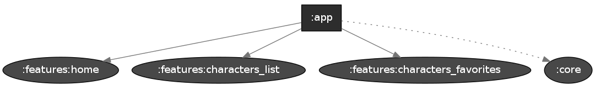
</p>

#### Core module

The `:core` module is an [com.android.library](https://developer.android.com/studio/projects/android-library)  for serving network requests or accessing to the database. Providing the data source for the many features that require it.

<p align="center">
 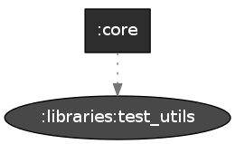
</p>

#### Features modules

The `:features` module are an [com.android.dynamic-feature](https://developer.android.com/studio/projects/dynamic-delivery) is essentially a gradle module which can be downloaded independently from the base application module. It can hold code and resources and include dependencies, just like any other gradle module.

| features                                                                                 |
|:----------------------------------------------------------------------------------------:|
| 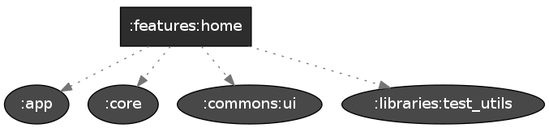                |
| 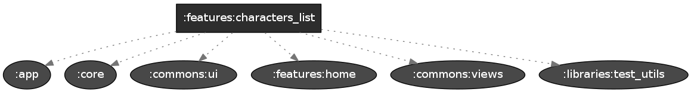     |
| 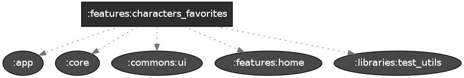 |

#### Commons modules

The `:commons` modules are an [com.android.library](https://developer.android.com/studio/projects/android-library) only contains code and resources which are shared between feature modules. Reusing this way resources, layouts, views, and components in the different features modules, without the need to duplicate code.

| ui                                                                     | views                                                                     |
|:----------------------------------------------------------------------:|:-------------------------------------------------------------------------:|
| 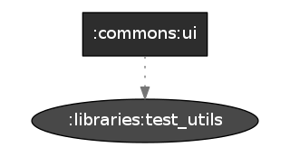 | 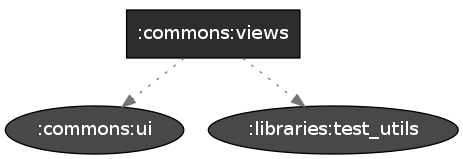 |


#### Libraries modules

The `:libraries` modules are an [com.android.library](https://developer.android.com/studio/projects/android-library), basically contains different utilities that can be used by the different modules.

<p align="center">
 
</p>

### Architecture components

Ideally, ViewModels shouldn’t know anything about Android. This improves testability, leak safety and modularity. ViewModels have different scopes than activities or fragments. While a ViewModel is alive and running, an activity can be in any of its lifecycle states. Activities and fragments can be destroyed and created again while the ViewModel is unaware.

Passing a reference of the View (activity or fragment) to the ViewModel is a serious risk. Lets assume the ViewModel requests data from the network and the data comes back some time later. At that moment, the View reference might be destroyed or might be an old activity that is no longer visible, generating a memory leak and, possibly, a crash.

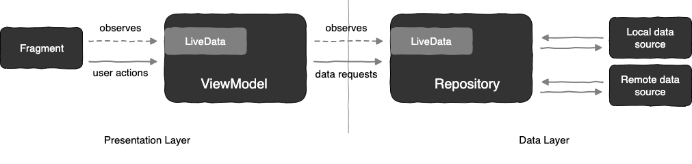

The communication between the different layers follow the above diagram using the reactive paradigm, observing changes on components without need of callbacks avoiding leaks and edge cases related with them.

### Build variants

The application has different product flavours: `Dev`, `QA`, `Prod`. Each variant has a specific target environment and to make easier to distinguish them the app uses a specific icon colour for `debug` and `release` build variant with descriptive app name. In this case and given that it's a sample, all variants have the same Marvel API endpoint.
But the idea is to have different environments target for Development and QA respectively, what doesn't affect the production environment. This is applicable to any tool, platform, service what is being used. For more information about build variant, check this [link](https://developer.android.com/studio/build/build-variants).

| Types   | DEV                                                                             | QA                                                                             | PROD                                                                         |
|---------|:-------------------------------------------------------------------------------:|:------------------------------------------------------------------------------:|:----------------------------------------------------------------------------:|
| Debug   | <p><br> MarvelDEV</p> | <p><br> MarvelQA</p> | <p><br> Marvel</p> |
| Release | <p><br> MarvelDEV</p>  | <p><br> MarvelQA</p>  | <p><br> Marvel</p>  |

## Documentation

The documentation is generated following [KDoc](https://kotlinlang.org/docs/reference/kotlin-doc.html) language (the equivalent of Java's [JavaDoc](https://en.wikipedia.org/wiki/Javadoc)) via documentation engine for Kotlin [Dokka](https://github.com/Kotlin/dokka).

To consult it check this [link](https://vmadalin.github.io/android-modular-architecture/) or open the project `/docs` directory.

## Tech-stack

This project takes advantage of many popular libraries, plugins and tools of the Android ecosystem. Most of the libraries are in the stable version, unless there is a good reason to use non-stable dependency.

### Dependencies

-   [Jetpack](https://developer.android.com/jetpack):
    -   [Android KTX](https://developer.android.com/kotlin/ktx.html) - provide concise, idiomatic Kotlin to Jetpack and Android platform APIs.
    -   [AndroidX](https://developer.android.com/jetpack/androidx) - major improvement to the original Android [Support Library](https://developer.android.com/topic/libraries/support-library/index), which is no longer maintained.
    -   [Benchmark](https://developer.android.com/studio/profile/benchmark.html) - handles warmup, measures your code performance, and outputs benchmarking results to the Android Studio console.
    -   [Data Binding](https://developer.android.com/topic/libraries/data-binding/) - allows you to bind UI components in your layouts to data sources in your app using a declarative format rather than programmatically.
    -   [Lifecycle](https://developer.android.com/topic/libraries/architecture/lifecycle) - perform actions in response to a change in the lifecycle status of another component, such as activities and fragments.
    -   [LiveData](https://developer.android.com/topic/libraries/architecture/livedata) - lifecycle-aware, meaning it respects the lifecycle of other app components, such as activities, fragments, or services.
    -   [Navigation](https://developer.android.com/guide/navigation/) - helps you implement navigation, from simple button clicks to more complex patterns, such as app bars and the navigation drawer.
    -   [Paging](https://developer.android.com/topic/libraries/architecture/paging/) - helps you load and display small chunks of data at a time. Loading partial data on demand reduces usage of network bandwidth and system resources.
    -   [Room](https://developer.android.com/topic/libraries/architecture/room) - persistence library provides an abstraction layer over SQLite to allow for more robust database access while harnessing the full power of SQLite.
    -   [ViewModel](https://developer.android.com/topic/libraries/architecture/viewmodel) - designed to store and manage UI-related data in a lifecycle conscious way. The ViewModel class allows data to survive configuration changes such as screen rotations.
-   [Coroutines](https://kotlinlang.org/docs/reference/coroutines-overview.html) - managing background threads with simplified code and reducing needs for callbacks.
-   [Dagger2](https://dagger.dev/) - dependency injector for replacement all FactoryFactory classes.
-   [Retrofit](https://square.github.io/retrofit/) - type-safe HTTP client.
-   [Coil](https://github.com/coil-kt/coil) - image loading library for Android backed by Kotlin Coroutines.
-   [Moshi](https://github.com/square/moshi) - makes it easy to parse JSON into Kotlin objects.
-   [Timber](https://github.com/JakeWharton/timber) - a logger with a small, extensible API which provides utility on top of Android's normal Log class.
-   [Stetho](http://facebook.github.io/stetho/) - debug bridge for applications via Chrome Developer Tools.
-   [and more...](https://github.com/VMadalin/kotlin-sample-app/blob/master/buildSrc/src/main/kotlin/dependencies/Dependencies.kt)

### Test dependencies

-   [UIAutomator](https://developer.android.com/training/testing/ui-automator) - a UI testing framework suitable for cross-app functional UI testing across system and installed apps.
-   [Espresso](https://developer.android.com/training/testing/espresso) - to write concise, beautiful, and reliable Android UI tests
-   [Robolectric](https://github.com/robolectric/robolectric) - industry-standard unit testing framework for Android.
-   [JUnit](https://github.com/junit-team/junit4) - a simple framework to write repeatable tests. It is an instance of the xUnit architecture for unit testing frameworks.
-   [Mockk](https://github.com/mockk/mockk) - provides DSL to mock behavior. Built from zero to fit Kotlin language.
-   [AndroidX](https://github.com/android/android-test) - the androidx test library provides an extensive framework for testing Android apps.
-   [and more...](https://github.com/VMadalin/kotlin-sample-app/blob/master/buildSrc/src/main/kotlin/dependencies/TestDependencies.kt)

### Plugins

-   [Ktlint](https://github.com/pinterest/ktlint) - an anti-bikeshedding Kotlin linter with built-in formatter.
-   [Detekt](https://github.com/arturbosch/detekt) - a static code analysis tool for the Kotlin programming language.
-   [Spotless](https://github.com/diffplug/spotless) - a code formatter can do more than just find formatting errors.
-   [Versions](https://github.com/ben-manes/gradle-versions-plugin) - make easy to determine which dependencies have updates.
-   [SafeArgs](https://developer.android.com/guide/navigation/navigation-pass-data#Safe-args) - generates simple object and builder classes for type-safe navigation and access to any associated arguments.
-   [Jacoco](https://github.com/jacoco/jacoco) - code coverage library
-   [and more...](https://github.com/VMadalin/kotlin-sample-app/blob/master/buildSrc/build-dependencies.gradle.kts)

## Resources

### Projects

This is project is a sample, to inspire you and should handle most of the common cases, but obviously not all. If you need to take a look at additional resources to find solutions for your project, visit these interesting projects:

-   [iosched](https://github.com/google/iosched) (by [google](https://github.com/google)) - official Android application from google IO 2019.
-   [plaid](https://github.com/android/plaid) (by [android](https://github.com/android)) - app which provides design news & inspiration, being an example of implementing material design.
-   [sunflower](https://github.com/android/sunflower) (by [android](https://github.com/android)) - a gardening app illustrating Android development best practices with Android Jetpack.
-   [architecture-components-samples](https://github.com/android/architecture-components-samples) (by [android](https://github.com/android)) - collection of samples for Android Architecture Components.
-   [architecture-sample](https://github.com/android/architecture-samples) (by [android](https://github.com/android)) - collection of samples to discuss and showcase different architectural tools and patterns for Android apps.
-   [android-clean-architecture-boilerplate](https://github.com/bufferapp/android-clean-architecture-boilerplate) (by [bufferapp](https://github.com/bufferapp)) - an android boilerplate project using clean architecture
-   [android-kotlin-clean-architecture](https://github.com/sanogueralorenzo/Android-Kotlin-Clean-Architecture) (by [sanogueralorenzo](https://github.com/sanogueralorenzo)) - android sample Clean Architecture app written in Kotlin.
-   [modularization-example](https://github.com/JeroenMols/ModularizationExample) (by [JeroenMols](https://github.com/JeroenMols)) - easy to understand real-life example of a modularized Android app.
-   [lego-catalog](https://github.com/Eli-Fox/LEGO-Catalog) (by [Eli-Fox](https://github.com/Eli-Fox)) - app illustrating current Android Architecture state using Android development best practices.
-   [tivi](https://github.com/chrisbanes/tivi) (by [chrisbanes](https://github.com/chrisbanes)) - an app which attempts to use the latest cutting edge libraries and tools.
-   [android-showcase](https://github.com/igorwojda/android-showcase) (by [igorwojda](https://github.com/igorwojda)) - app following best practices: Kotlin, coroutines, Clean Architecture, feature modules, tests, MVVM, static analysis.

### Articles

A collection of very interesting articles related last android community tendencies and recommendations for start to take in consideration for your current/next project:

-   [Transform monolith to modularization application](https://medium.com/androiddevelopers/a-patchwork-plaid-monolith-to-modularized-app-60235d9f212e)
-   [Using the Navigation Component in a Modular World](https://medium.com/swlh/using-the-navigation-component-in-a-modular-world-e7578825962)
-   [Dependency injection in a multi module project](https://medium.com/androiddevelopers/dependency-injection-in-a-multi-module-project-1a09511c14b7)
-   [ViewModels and LiveData: Patterns + AntiPatterns](https://medium.com/androiddevelopers/viewmodels-and-livedata-patterns-antipatterns-21efaef74a54)
-   [Dynamic feature and regular modules using Dagger2](https://blog.q42.nl/dynamic-feature-and-regular-modules-using-dagger2-12a7edcec1ff)
-   [Android Architecture starring Kotlin Coroutines, Jetpack (MVVM, Room, Paging), Retrofit and Dagger 2](https://proandroiddev.com/android-architecture-starring-kotlin-coroutines-jetpack-mvvm-room-paging-retrofit-and-dagger-7749b2bae5f7)
-   [Official Kotlin Style Guide with Ktlint](https://proandroiddev.com/official-kotlin-style-guide-with-ktlint-4a649c172956)
-   [Gradle dependency management with Kotlin (buildSrc)](https://proandroiddev.com/gradle-dependency-management-with-kotlin-94eed4df9a28)
-   [Detecting Kotlin Code Smells with Detekt](https://proandroiddev.com/detecting-kotlin-code-smells-with-detekt-e79c52a35faf)
-   [Best coding practices, tips and more for Android](https://medium.com/mindorks/best-coding-practices-tips-and-more-for-android-4ec03c7eeb2c)

### Libraries

The open-source community create and maintains tons of awesome libraries making your job more easy, giving the opportunity to use them in your developments. Here are a very important collection of them:

-   [awesome-android-ui](https://github.com/wasabeef/awesome-android-ui) - collection list of awesome Android UI/UX libraries.
-   [awesome-android-libraries](https://github.com/KotlinBy/awesome-kotlin#android-libraries) - collection of awesome Kotlin related stuff.
-   [android-arsenal](https://android-arsenal.com/) - android developer portal with tools, libraries, and apps.

### Best practices

Avoid reinventing the wheel by following these guidelines:

-   [Google best practices](https://developer.android.com/distribute/best-practices)
-   [Android development best practices](https://github.com/futurice/android-best-practices)

### Codelabs

Google Developers Codelabs provide a guided, tutorial, hands-on coding experience. Most codelabs will step you through the process of building a small application, or adding a new feature to an existing application. They cover a wide range of android concepts to learn and practice:

-   [Android Developer Fundamentals](https://developer.android.com/courses/fundamentals-training/toc-v2)
-   [Android Developer Codelabs](https://codelabs.developers.google.com/?cat=Android)

## Contributions

All contributions are welcome!
Please feel free to post questions, recommendations, ideas, bugs by create [new issue](https://github.com/VMadalin/kotlin-sample-app/issues/new) following the template or if you want create directly [new pull request](https://github.com/VMadalin/kotlin-sample-app/compare).

## Authors

<a href="https://twitter.com/MValceleanu" target="_blank">
  
</a>

**Madalin Valceleanu**

[](https://www.linkedin.com/in/vmadalin/)
[](https://twitter.com/MValceleanu)
[](https://medium.com/@vmadalin)
[](http://vmadalin.com/)

## License

```license
Copyright 2019-2020 vmadalin.com

Licensed under the Apache License, Version 2.0 (the "License");
you may not use this file except in compliance with the License.
You may obtain a copy of the License at

    http://www.apache.org/licenses/LICENSE-2.0

Unless required by applicable law or agreed to in writing, software
distributed under the License is distributed on an "AS IS" BASIS,
WITHOUT WARRANTIES OR CONDITIONS OF ANY KIND, either express or implied.
See the License for the specific language governing permissions and
limitations under the License.
```
